# Sim Speed Fairness Bug - Root Cause Analysis

## Problem Statement

When simulation speed is increased to 30x or higher in Training mode, Simple AI starts winning against Script A consistently, even though Script A dominates at normal speed. This indicates **unfair timing mechanics** that advantage one player type over another.

## Root Cause: Asymmetric Input Latency

I've identified the root cause in the game loop mechanics:

### The Two Input Processing Paths

| Fighter Type | Input Method | Latency | Code Reference |
|-------------|--------------|---------|----------------|
| **Simple AI** | `processAi()` - synchronous NN prediction | **0 frames** | [GameEngine.ts:296-341](file:///Users/misteruser/Desktop/GitHub/neuroevolution-stickman-fighters/services/GameEngine.ts#L296-L341) |
| **Custom Script** | `processCustom()` - async Web Worker | **1+ frames** | [GameEngine.ts:377-416](file:///Users/misteruser/Desktop/GitHub/neuroevolution-stickman-fighters/services/GameEngine.ts#L377-L416) |

### How the Bug Manifests

The game loop in [useMatchUpdate.ts:88](file:///Users/misteruser/Desktop/GitHub/neuroevolution-stickman-fighters/composables/useMatchUpdate.ts#L88) runs `simulationSpeed` loops per render frame:

```typescript
const loops = currentSettings.gameMode === 'ARCADE' ? 1 : currentSettings.simulationSpeed;

for (let i = 0; i < loops; i++) {
    match.p1.update(p1Input, match.p2);  // Script A gets cached action
    match.p2.update(dummyInput, match.p1); // Simple AI gets fresh NN output
}
```

**At 1x speed (1 loop per frame):**
- Script A: Requests action → Worker computes → Returns cached (previous frame) action
- Simple AI: Computes NN prediction synchronously → Returns current action
- **Impact**: 1 frame of latency for Script A (≈16ms) - barely noticeable

**At 30x speed (30 loops per frame):**
- Script A: Gets **same cached action** for all 30 simulation ticks (worker only receives 1 request per frame and can only respond once per frame)
- Simple AI: Gets **fresh NN output** each of the 30 ticks (synchronous, reacts to updated game state)
- **Impact**: Script A is effectively "frozen" reacting to 30-tick-old game state while Simple AI adapts in real-time

> [!CAUTION]
> At high simulation speeds, Script A is operating on extremely stale information while Simple AI has a real-time advantage. This is fundamentally unfair.

### Visual Diagram

```mermaid
sequenceDiagram
    participant Loop as Game Loop (30 ticks)
    participant Script as Script A (Worker)
    participant AI as Simple AI (Sync)
    
    Loop->>Script: requestAction(state_t0)
    Note over Script: Worker computes...
    
    loop 30 ticks
        Loop->>AI: processAi(current_state) → fresh action
        Loop->>Script: getAction() → returns cached action from t0
        Note right of Script: Same stale action!
    end
    
    Script-->>Loop: Worker returns result (too late)
```

---

## Proposed Solutions

### Option A: Synchronous Script Execution

Remove the Web Worker for script execution during high-speed simulation. Instead, compile the script to a sandboxed function that runs synchronously like the NN.

**Pros:**
- Perfect parity with AI timing
- Scripts react instantly like the NN does

**Cons:**
- Removes crash protection (loops/infinite loops can freeze main thread)
- Need to add execution time limits (e.g., 1ms budget per decision)

---

### Option B: Force Same-Latency for AI (Add Delay)

Add artificial 1-frame latency to Simple AI decisions to match the script worker latency.

**Implementation:**
```typescript
// In processAi(): return last frame's decision, compute this frame's for next time
this.cachedAiAction = computeNeuralNetwork();
return this.previousAiAction;
```

**Pros:**
- Fair - both have same latency
- No changes to worker architecture

**Cons:**
- Makes AI slightly worse overall
- Both players are now "delayed" - feels less responsive

---

### Option C: One Worker Request Per Simulation Tick (Not Recommended)

Instead of one request per render frame, issue requests each simulation tick and await responses.

**Why Not:**
- Would make 30x speed actually 30x slower
- Worker message passing has inherent overhead (~0.5-2ms per round trip)
- Would negate the performance benefit of fast simulation

---

### Option D: Hybrid - Use Cached Actions Intelligently

During high-speed simulation, both AI and Script operate on the **same cached decisions** per render frame, updating only once per frame regardless of internal loops.

**Implementation:**
```typescript
// Before the loop:
const p1Action = match.p1.computeDecision(match.p2); // Script or AI
const p2Action = match.p2.computeDecision(match.p1);

// Inside the loop: use cached actions for both
for (let i = 0; i < loops; i++) {
    match.p1.update(p1Action, match.p2);
    match.p2.update(p2Action, match.p1);
}
```

**Pros:**
- Fair - both use same decision for all loops
- Maintains security of Web Worker for scripts
- Simplest to implement

**Cons:**
- Neither player reacts to mid-loop changes
- May affect gameplay dynamics (but consistently for both)

---

## Recommendation Summary

**Option D (Hybrid - Cache Both)** is the best balance because:

1. **Fair**: Both players operate under identical constraints
2. **Secure**: Custom scripts still run in isolated workers
3. **Fast**: No additional async overhead
4. **Conservative**: Smallest change to existing architecture

The key insight is that **when running multiple simulation ticks per frame, mid-tick reactions are impossible for async systems anyway**. By making the AI also use a cached decision, we level the playing field.

---

## Decision Log

| Date | Decision |
|------|----------|
| 2026-01-04 | **Initially selected Option D** as implementation approach - caching both decisions per frame. |
| 2026-01-04 | **Testing revealed Option D was insufficient** - while fair (both cached), neither fighter could react mid-frame, which hurt strategic scripts more than reactive AI. |
| 2026-01-04 | **Implemented Option B instead** - AI now uses 1-tick delayed decisions. |
| 2026-01-04 | **Option B also failed** - AI still computes 100x per frame vs Script's 1x. The asymmetry is per-FRAME, not per-tick. |
| 2026-01-04 | **Selected Option A (Synchronous Script)** - Only viable solution for true timing parity. |

---

# Option A: Synchronous Script Execution - Implementation Plan

## Why Option A is Necessary

All other options failed because the fundamental problem is **architectural**:


The Web Worker can only respond **once per frame** (when JavaScript yields to the event loop). No matter how we delay or cache, there's no way to make the Script compute 100 times per frame while it runs in a Worker.

---

## The Execution Time Budget Concept

### What is it?

When running Scripts **synchronously** on the main thread, there's a risk: if the user writes an infinite loop, the browser will freeze. To prevent this, we give each script execution a **time budget**.

### How the Browser Event Loop Works


At 60 FPS, each frame has **~16ms total**. If we run at 100x simulation speed:
- 100 ticks per frame
- Each tick must complete in: `16ms / 100 = 0.16ms` or less

### The 1ms Budget Explained

```
┌─────────────────────────────────────────────────────────────────────┐
│                        FRAME (~16ms budget)                         │
├─────────────────────────────────────────────────────────────────────┤
│                                                                     │
│  ┌──────────┐ ┌──────────┐ ┌──────────┐     ┌──────────┐           │
│  │  Tick 1  │ │  Tick 2  │ │  Tick 3  │ ... │ Tick 100 │           │
│  │          │ │          │ │          │     │          │           │
│  │ AI: ~0.1ms │ AI: ~0.1ms │ AI: ~0.1ms     │ AI: ~0.1ms           │
│  │Script:≤1ms│ │Script:≤1ms│ │Script:≤1ms│   │Script:≤1ms│         │
│  │ Physics  │ │ Physics  │ │ Physics  │     │ Physics  │           │
│  └──────────┘ └──────────┘ └──────────┘     └──────────┘           │
│                                                                     │
│  Total Script Time: ≤ 100ms (if scripts take max 1ms each)         │
│  ⚠️ This exceeds 16ms! Need to be more careful...                  │
│                                                                     │
└─────────────────────────────────────────────────────────────────────┘
```

> [!WARNING]
> At 100x speed with 1ms budget per script, we'd need 100ms just for scripts - far exceeding our frame budget!

### Revised Budget Strategy

We need a **per-frame** budget, not per-tick:

```
┌─────────────────────────────────────────────────────────────────────┐
│                        FRAME (~16ms budget)                         │
├─────────────────────────────────────────────────────────────────────┤
│                                                                     │
│  ┌─────────────────────────────────────────────────────────────┐   │
│  │              Script Execution Budget: 8ms total              │   │
│  │                                                              │   │
│  │  At 100x speed: 8ms / 100 ticks = 0.08ms (80μs) per tick    │   │
│  │  At 10x speed:  8ms / 10 ticks  = 0.8ms per tick            │   │
│  │  At 1x speed:   8ms / 1 tick    = 8ms per tick              │   │
│  │                                                              │   │
│  └─────────────────────────────────────────────────────────────┘   │
│                                                                     │
│  ┌─────────────────────────────────────────────────────────────┐   │
│  │              Remaining: Physics, AI, Rendering (8ms)        │   │
│  └─────────────────────────────────────────────────────────────┘   │
│                                                                     │
└─────────────────────────────────────────────────────────────────────┘
```

### What Happens if Script Exceeds Budget?

```mermaid
flowchart TD
    A[Start Script Execution] --> B{Execution Time?}
    B -->|"< Budget"| C[✅ Return Action]
    B -->|"> Budget"| D[⚠️ Timeout Triggered]
    D --> E[Return Default Action<br/>no movement, no attack]
    D --> F[Log Warning in Console]
    D --> G[Increment Timeout Counter]
    G --> H{Too Many Timeouts?}
    H -->|Yes| I[🛑 Show Error Toast<br/>Script is too slow!]
    H -->|No| J[Continue Match]
```



---

## Infinite Loop Prevention

Since this is an educational project, users WILL make mistakes. We need **compile-time detection**, not just runtime protection.

### Detection Strategy

```mermaid
flowchart TD
    A[User Clicks Save] --> B[Parse Script to AST]
    B --> C{Contains while/for loops?}
    C -->|No| D[✅ Safe - Allow Save]
    C -->|Yes| E{Loop has break condition?}
    E -->|Yes| F{Is condition always true?}
    F -->|No| D
    F -->|Yes| G[❌ BLOCK SAVE]
    E -->|No| G
    G --> H[Show Error:<br/>Potential infinite loop detected]
```



### Patterns to Detect

| Pattern | Detection | Action |
|---------|-----------|--------|
| `while(true)` without `break`/`return` | AST analysis | ❌ Block |
| `for(;;)` without `break`/`return` | AST analysis | ❌ Block |
| `while(x)` where `x` is never modified | Data flow analysis | ⚠️ Warn |
| Recursion without base case | Call graph analysis | ⚠️ Warn |

### Validator Changes Required

The current script validator in [CustomScriptCompiler.ts](file:///Users/misteruser/Desktop/GitHub/neuroevolution-stickman-fighters/services/CustomScriptCompiler.ts) will need:

1. **AST Parsing**: Use a lightweight JS parser (e.g., `acorn` or `esprima`)
2. **Loop Analysis**: Check all loop constructs for safe termination
3. **Blocking Save**: If dangerous pattern detected, prevent saving AND compiling

---

## Implementation Checklist

- [ ] **Phase 1: Synchronous Execution**
  - [ ] Create `SyncScriptExecutor` that runs script in main thread
  - [ ] Add time budget tracking with `performance.now()`
  - [ ] Modify `processCustom()` to use sync executor instead of worker
  - [ ] Keep worker as fallback for edge cases

- [ ] **Phase 2: Infinite Loop Detection**
  - [ ] Add AST parser (acorn) to dependencies
  - [ ] Create `analyzeLoopSafety(code: string)` function
  - [ ] Update `compileScript()` to reject unsafe code
  - [ ] Add clear error messages in Script Editor UI

- [ ] **Phase 3: Runtime Protection**
  - [ ] Implement frame budget tracking
  - [ ] Add timeout counter per fighter
  - [ ] Show performance warnings in UI when scripts are slow

---

## Code Architecture for Option A


